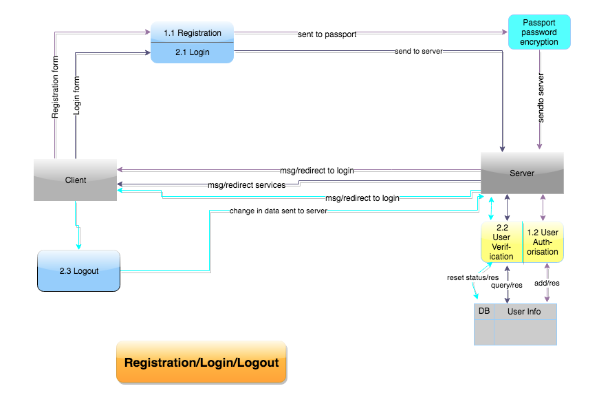
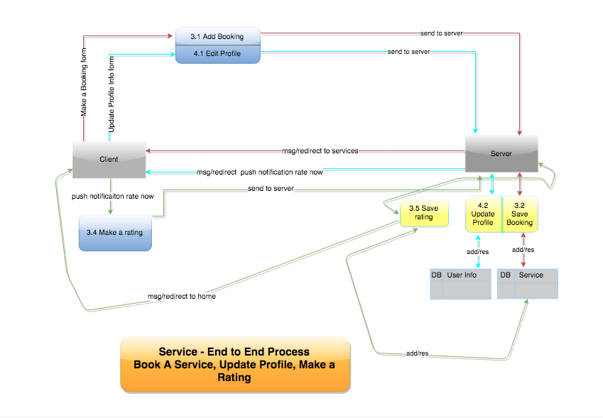
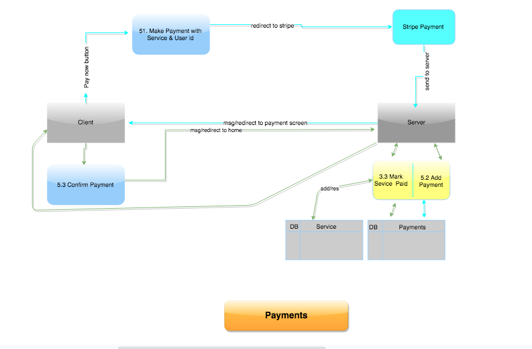
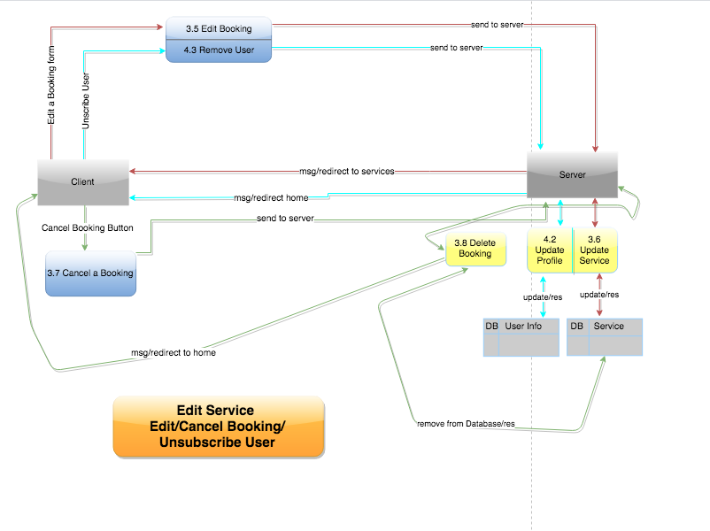
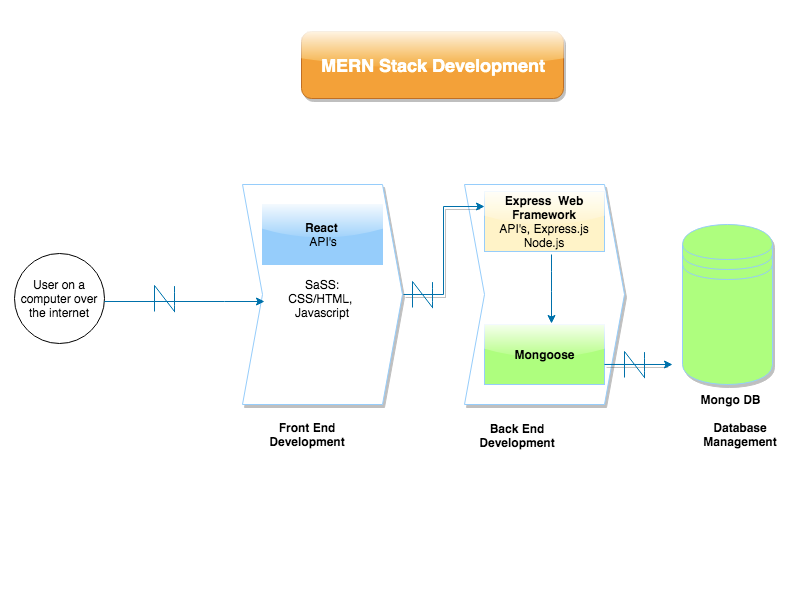

# Cloud-Fitness

## Description of the App
### Purpose:
The purpose of this assessment is to design a web application for a commercial client. For this assessment we are creating a web application for a gym. Our gym app is called Cloud Fitness and it will store the information of the gym members, help them book gym sessions and select their chosen workout routines. 

Our client is the owner of Cloud Fitness and this gym web app will benefit her in a number of ways being:
- Our client envisions that all bookings will be made online and this web app will allow this to occur.
- In future iterations, it will give our client statistics of usability and data for accounting and marketing purposes.
- Our client envisions that this web app will create a social community where gym members create friendships, encourage each other and create a positive and inclusive environment.
- The web app is a necessary requirement to the gym operations due to all the bookings and payments being made online and the gym cannot function without it. The whole concept of this gym is to run 24/7 and with minimal interactions with staff during staff hours. It is also crucial to minimise the administration and time required to run the business.

There are a number of ways this gym web app will benefit society. These are:
According to the New Daily, 56% of Australians are inactive or don't get enough exercise, increasing their risk of cancer, weight gain and type 2 diabetes. Therefore, going to the gym is a very important part of a person's life as it helps to:
- Increase your body's physical activity
- Relieve stress
- Improve your sleep
- Improve your social life by creating friends at the gym.

Cloud Fitness attempts to make this easier for Australians by enabling them to register, book gym sessions and select workout routines online.

### Functionality
Minimum Viable Product(MVP):
- Register for a gym account with your full name, date of birth, email, phone number, billing information and physical profile(Height, weight, gender, level of fitness etc).
- Once logged in, you can read, book and delete your gym session.
- WHile booking a gym session, user selects a workout routine. Each gym member(user) chooses:
    - GOALS: flex & relax, aerobic, strength
    - LEVELS: developed, intermediate, advanced.
    - PEOPLE: single, couple, families, groups(maximum 8 people)
    - TIME 20, 30, 40 or 50 minutes.

Future Enhancements once we've completed the MVP:
- The gym users will then be directed to a Payment Gateway, where they can pay their gym sessions easily.
- After the gym session is completed, a feedback poll will pop-up to analyse results and generate statistics.

### Tech Stack
For this web app, we will be using MERN, SASS and Heroku.
MERN stands for MongoDB Express.JS React.JS Node.JS
- MongoDB: An open source database management system that uses a document-oriented database model which supports various forms of data.
What are you using it for?
Our team is using MongoDB as a document database to store the data of our gym users i.e ID, full name, date of birth, email, phone number, billing information and physical profile(Height, weight, gender, level of fitness). Also, to facilitate all the needs of he gym web app, we will need a Users table, a services table and a payments table.

- Express.JS: A minimal and flexible Node.js web app framework that provides a set of features for web applications.
What are you using it for?
Our team will use Express as our back-end and make routes to create, read, update and delete gym sessions. We will also have routes to subscribe/unsubscribe, the payment process, updating user details, selecting workout routines and classes and generating feedback polls.

- React.JS: A javascript library for building user interfaces. React is maintained by Facebook and a community of individual developers and companies.
What we are using it for:
We plan to use React as our front-end to display the contents of our gym web app. We plan to add routes for the contents being displayed on our browser. These contents are: authentication process, calendar for gym sessions, managing user profile, managing workout routines, payment process and feedback polls.

- Node.JS: An open-source, cross-platform, JavaScript runtime environment that executes JavaScript code outside of a browser. 
What we are using it for:
Our team plans on using Node to run our startup scripts to run the server-side, install any dependencies, for postman when we use it to send requests to the URL and to make our JavaScript asynchronous.

- SASS a CSS framework. It is the most stable and powerful professional grade CSS extension language in the world.
What we are using it for:
Our team intends to use SASS as our CSS framework for our web app. SASS generates CSS files. We plan to use SASS to style the contents of our web app, keep the CSS dry and the style consistent.

- Heroku is a deployment platform for our web app. Heroku is a cloud platform service supporting several programming languages.
What we are using it for:
Our team plans to use Heroku as our deployment platform for our web app. Heroku will generate a URL for our web app.

### Target Audience
The ideal customer for Cloud Fitness is a 18-35 years old individual, living or working within five miles of one of our gym clubs. That also believe fitness is important to health and a great way to make friends and spend time with them.

Market segmentation:
According to the econ gym, 50% of their customers were aged between 24-35. These customers were finished with school and were able to afford gym. They had the time and money.

30% of their customers were aged between 18-20. These customers were mainly still in school. They had the time to come to the gym regularly. They also have school breaks during the summer holidays in which they can spend more time at the gym, thus creating an increase in customers during the months of November to February.

20% of their customers were above 35 years old. This was their smallest market segmentation because people 35+ have a job and a family and as people get older, they tend to lose their motivation to attend gym regularly. Through the development of our gym web app, we hope to improve this statistic.

### Planning Methodology
Through meetings we have decided on the use of Trello to plan and manage our Product.  We have agreed to use Github for code management and heroku as our deployment platform. We are using Slack for commmunication and sharing of diagrams. We have agreed to being on-site Monday to Wednesday and off-site at other times. When offsite and working on the project communication is via Slack and through Github reviews and pull requests.

When creating our Trello board, we all worked together to create the cards. Each card shows the level of work or difficulty. Every card is clearly marked with the team member or members who worked on it.  Each team member should move the cards on the trello board to reflect where they are at with that piece of work. This enables us to do work in sprints, to specifications of the client and follow iterations as with agile methodology.

We have made cards in Trello that help us to divide up the work. At the moment what areas we work on, are determined by the team. We agree to working on feature branches and the group members to do code reviews and the person who creates the branch, merges the branch into master or via agreement. We agree to regular commits when working on code. Should conflicts arise the parties with conflicting code should work together or be in agreement what code to accept and merge.

We agreeed to do daily stand ups on Monday to Wednesday and regular communication on Slack when working off-site. As a team we make requests for other meetings as deemed necessary.

At our meeting with the client, we agreed that our main forms of communication would be through email or slack. We sent through wireframes of our design for the website and asked further input from the client on design via email.  The client will sign off on the design and we'll notify the client regarding our deployments for heroku during the project so that progress can be seen and feedback given.

## R2  Diagrams
### User Registration, Login, and Logout

### Service - End to End

### Payments - Part of End to End Process

### Edit, Cancel Booking Details and Unsubscribe User

## R3 Diagrams
### App Architecture Diagram

## R4 User Stories
- Website should be design with the user in mind with clearly layed out designs and flow process through the application, utilising placement and colour to easily draw user to where they want to go. With apporpriate messages of sucess and error so a user knows that the process occured successfully or what went wrong, so a user can correct the issue easily. 
### User Admin
-  I can register, with username (optional),email and password with password encryption(passport). 
- I am able to log in / log out with username (optional) or email, and password.  
- I can set availability, this capability was an instruciton by the Client to set up in the code as 24/7 * 8 slots per time slot, with timeslots of 20, 30, 40, 50 mins.  We have put it to the client potential for 30 and 50 minutes slots to cause overfolow into the next hour.  We also asked if the were any set breaks between between appointments.
- I can create, edit, a timetable. We are awaiting data from client so this is not yet included in our design wireframes. We will create wireframes for the the timetable once client can provide
- I can see all bookings that have made, and who has booked in. 
- I can set prices and change prices

### User Client
-  I can register, with username (optional),email and password with password encryption(passport). 
- I am able to log in / log out with username (optional) or email, and password. 
- I can edit my user profile.  Clearly viewable place on the website indicating to the user to button placement for editing their profile. 
- I can book a session. A user can book in for class or a workout session for the ability to set the timeframe for the session.
- I can set a level
- I can add addition participants to my booking. 
- I can edit or cancel an appointment.
- I can view my appointments
- I can pay for my appointments

### Future interations
- I can see msg from clients, chat messaging Chat bot.

## R5 Wireframes
### Desktop
.png)
.png)
.png)

### Mobile
.png)
.png)
.png)
.png)

## ScreenShots

### Trello Board

Definitions to Design:

.png)

Progress to Testing

.png)
.png)

### Future Enhancements:

.png)

### Testing Spreadsheet

.png)
